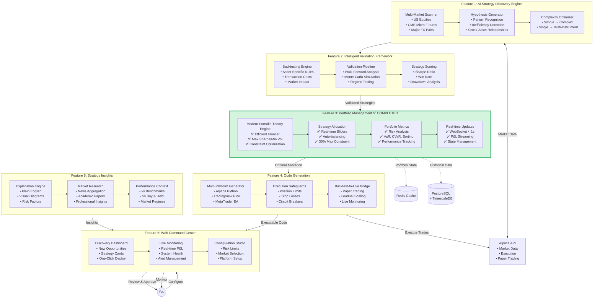

# AlphaStrat System Architecture & Flow
## How Portfolio Management (F003) Fits Into The Complete System

Based on the scope documents, here's how the complete system flows and where our completed Portfolio Management fits:



## System Flow Narrative

### 1. **Discovery Phase** (F001 - Not Yet Built)
```
📡 The AI continuously scans markets for opportunities
   ↓
🔍 Identifies patterns and inefficiencies
   ↓
🧪 Generates testable hypotheses
   ↓
⚙️ Optimizes strategy complexity
```

### 2. **Validation Phase** (F002 - Partially Built)
```
📊 Rigorous backtesting with market-specific rules
   ↓
🎲 Monte Carlo simulation for robustness
   ↓
✅ Only strategies with Sharpe > 1.0 pass
   ↓
📈 Scored and ranked by risk-adjusted returns
```

### 3. **Portfolio Construction Phase** (F003 - ✅ COMPLETED)
```
🎯 Validated strategies enter portfolio optimizer
   ↓
📉 Efficient frontier analysis determines optimal mix
   ↓
⚖️ Allocations respect 30% max constraint
   ↓
📊 Real-time metrics track portfolio health
   ↓
🔄 WebSocket streams live updates
```

### 4. **Code Generation Phase** (F004 - Not Yet Built)
```
💻 Optimal allocations converted to executable code
   ↓
🛡️ Safety checks and limits embedded
   ↓
📝 Platform-specific code generated
   ↓
🚀 Ready for deployment
```

### 5. **Insights Phase** (F005 - Not Yet Built)
```
📚 Each strategy explained in plain English
   ↓
🔬 Market research provides context
   ↓
📊 Performance compared to benchmarks
   ↓
💡 You understand WHY strategies work
```

### 6. **Command Center** (F006 - Partially Built)
```
🖥️ Dashboard shows new discoveries
   ↓
👁️ You review with full explanations
   ↓
✅ One-click approval to paper trading
   ↓
📈 Monitor live performance
   ↓
🔄 System learns and improves
```

## Key Integration Points

### Where F003 (Portfolio Management) Connects:

1. **INPUT**: Receives validated strategies from F002
   - Strategy returns data
   - Risk metrics
   - Correlation matrices

2. **PROCESSING**: Our completed components
   - ✅ MPT optimization engine
   - ✅ Efficient frontier calculation
   - ✅ Allocation constraints (30% max)
   - ✅ Real-time metrics calculation

3. **OUTPUT**: Feeds optimal allocations to F004
   - Optimal weights per strategy
   - Risk budgets
   - Rebalancing schedules

4. **MONITORING**: Streams to F006
   - ✅ WebSocket real-time updates
   - ✅ Portfolio state via Redis
   - ✅ Performance metrics

## Current System Status

### ✅ Completed Components:
- **F003**: Portfolio Management (100%)
- **F002**: Partial - Basic backtesting engine
- **F006**: Partial - Basic dashboard structure

### 🔄 In Progress:
- **F002**: Advanced validation (Monte Carlo, walk-forward)
- **F006**: Full dashboard integration

### 📋 Not Started:
- **F001**: AI Strategy Discovery Engine
- **F004**: Code Generation & Execution Bridge
- **F005**: Strategy Insight & Research Integration

## Next Priority Actions (Per Scope):

1. **Complete F001 Discovery Engine**
   - This is the core differentiator
   - Without it, we don't have strategies to manage
   - Focus on US equities first via Alpaca

2. **Enhance F002 Validation**
   - Add Monte Carlo simulation
   - Implement walk-forward analysis
   - Asset-specific validation rules

3. **Build F004 Code Generation**
   - Start with Alpaca Python
   - Add safety checks
   - Paper trading integration

4. **Implement F005 Insights**
   - Plain English explanations
   - Visual strategy diagrams
   - Market context

## How to Use What We've Built:

### Current Capabilities:
```python
# 1. Manual Strategy Input (temporary until F001 built)
strategies = ['rsi_mean_reversion', 'macd_momentum', ...]

# 2. Portfolio Optimization (F003 - Working)
POST /api/v1/portfolio/optimize
→ Returns optimal allocations using MPT

# 3. Real-time Monitoring (F003 - Working)
WebSocket /ws
→ Streams portfolio updates < 1s latency

# 4. Risk Management (F003 - Working)
GET /api/v1/portfolio/metrics
→ VaR, Sharpe, Sortino, Max Drawdown
```

### Future Automated Flow:
```python
# F001: AI discovers strategies automatically
discovered_strategies = ai_scanner.find_opportunities()

# F002: Validate thoroughly
validated_strategies = validator.test(discovered_strategies)

# F003: Optimize portfolio (READY NOW)
optimal_portfolio = mpt_engine.optimize(validated_strategies)

# F004: Generate code
executable_code = code_generator.create(optimal_portfolio)

# F006: Deploy and monitor
dashboard.deploy_to_paper_trading(executable_code)
```

## Summary

The Portfolio Management system (F003) we've built is the **portfolio optimization and monitoring infrastructure** that will manage the strategies discovered by the AI engine (F001). 

Think of it this way:
- **F001** = The brain that finds opportunities
- **F002** = The validator that ensures they're real
- **F003** = The portfolio manager that optimizes allocation ✅ DONE
- **F004** = The translator that creates executable code
- **F005** = The teacher that explains everything
- **F006** = The control panel where you oversee it all

We've built the portfolio management infrastructure first, which is good - now we need to build the discovery engine that will feed strategies into it!