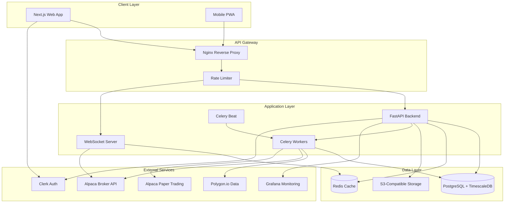

# 2.1 - Technical Architecture: AI Trading Strategy Platform MVP (Updated)

## Architecture Philosophy
**Hybrid MVP-to-Production Approach**: Start simple but with production-grade foundations for critical components. This means using managed services where possible, proven patterns for financial systems, and clear separation between research/discovery components (can be iterative) and execution components (must be bulletproof from day one).

## Core Technology Stack
**Frontend**: Next.js 14+ with TypeScript
**Backend**: FastAPI (Python 3.11+)
**Database**: PostgreSQL 16 with TimescaleDB extension
**Authentication**: Clerk (managed auth service)
**Hosting/Deployment**: Railway.app (simple PaaS)
**Additional Core Services**: Redis for caching, Celery for async tasks
**Market Data**: Polygon.io (best free tier + clean API)
**Broker Integration**: Alpaca (excellent API + built-in paper trading)
**Futures Data** (Post-MVP): Interactive Brokers API or TradeStation
**Corporate Actions**: Polygon.io reference data API
**Time Zone Management**: pytz with all timestamps stored in UTC
**Research Integration**: Web scraping with BeautifulSoup, RSS feed aggregation
**Natural Language**: OpenAI API for strategy explanations and research summarization

## Additional Libraries & Dependencies
**State Management**: Zustand (simpler than Redux)
**Forms & Validation**: React Hook Form + Zod
**Testing Framework**: Pytest (backend), Jest (frontend)
**UI Components**: shadcn/ui + Tailwind CSS
**API Client**: Axios with TypeScript codegen
**Development Tools**: Docker, pre-commit hooks, Black/Ruff
**Backtesting Engine**: Vectorbt (GPU-ready but works great on CPU)
**Technical Analysis**: TA-Lib with Python wrapper
**Portfolio Optimization**: PyPortfolioOpt
**Monitoring**: Grafana + Prometheus for operational dashboards
**Web Scraping**: BeautifulSoup4 + Scrapy for research gathering
**Content Analysis**: newspaper3k for article extraction
**Explanation Generation**: LangChain for structured explanations

## Why These Choices?

### Market Data: Polygon.io
- **Free tier**: 5 API calls/minute covers development
- **Paid tier**: $79/month unlimited for production
- **Coverage**: Stocks, options, forex, crypto
- **Features**: Real-time WebSocket, 10+ years history
- **Corporate Actions**: Reference data API included
- **Better than alternatives**: Cleaner API than Yahoo Finance, more reliable than Alpha Vantage

### Broker: Alpaca
- **Commission-free** trading for stocks
- **Excellent API**: REST + WebSocket, sub-second execution
- **Built-in paper trading**: Identical API for paper/live
- **Market Coverage**: US equities, ETFs, crypto, limited futures (CME micro contracts)
- **Better than alternatives**: 
  - vs Interactive Brokers: Much simpler API, no minimums
  - vs TD Ameritrade: Better API documentation
  - vs TradeStation: Free with no platform fees

### Backtesting: Vectorbt
- **Performance**: Vectorized operations 100x faster than loop-based
- **Flexibility**: Works with pandas, supports complex strategies
- **GPU-ready**: Can use CuPy later without code changes
- **Better than alternatives**:
  - vs Backtrader: 10x faster, cleaner API
  - vs Zipline: Actively maintained, better documentation

## Security Considerations
**Authentication & Authorization**: Clerk provides OAuth, 2FA, and session management out-of-box
**Data Protection**: All strategy parameters encrypted at rest, API keys in environment variables
**API Security**: Rate limiting via FastAPI middleware, API key rotation reminders
**Infrastructure Security**: Railway provides automatic SSL, DDoS protection
**Compliance Requirements**: Audit logs for all trades, immutable transaction history
**Broker Security**: Alpaca API keys scoped to trading only, separate paper/live credentials

## Features

### AI Strategy Discovery Engine
Core intelligence system continuously analyzing market inefficiencies across multiple assets.

#### Multi-Market Inefficiency Scanner
Scans US equities, available futures, and FX markets simultaneously to discover uncorrelated opportunities across asset classes.

**Technologies Involved**:
- Celery Beat for scheduled scanning tasks
- pandas/numpy for data analysis
- **Polygon.io WebSocket** for real-time data
- **Vectorbt** for rapid hypothesis testing
- PostgreSQL with TimescaleDB for storing discovered patterns
- **pytz** for timezone handling across markets

**Technical Requirements**:
- Process 1000+ symbols per scan cycle
- Sub-minute latency for intraday opportunities
- Handle corporate actions via Polygon.io reference data
- Maintain 5 years of historical data
- All timestamps in UTC with proper timezone conversion

**Implementation Approach**:
Polygon.io WebSocket feeds real-time data into Redis. Celery workers pull data chunks for analysis, using Vectorbt to rapidly test inefficiency hypotheses. Each worker specializes in different pattern types. Results pipeline through validation before storage. Frontend receives updates via Server-Sent Events. All time-sensitive operations properly handle market hours across timezones using pytz.

**MVP Market Limitations**:
- Futures limited to CME micro contracts available via Alpaca
- FX limited to major pairs on Alpaca
- Commodity exposure via ETF proxies (GLD, USO, etc.)

#### Strategy Complexity Optimizer
Automatically determines optimal strategy sophistication level for best risk-adjusted returns.

**Technologies Involved**:
- scikit-learn for complexity analysis
- **Optuna** for hyperparameter optimization (better than Ray for this use case)
- PostgreSQL for parameter history
- Redis for caching optimization results

**Technical Requirements**:
- Test 10+ complexity variations per strategy
- Complete optimization within 1 hour
- Track performance degradation with complexity
- Maintain interpretability scores

**Implementation Approach**:
Optuna's Bayesian optimization efficiently explores parameter space. Each trial backtested with Vectorbt. Complexity scored by parameter count, lookback requirements, and execution needs. Results include Sharpe ratio vs complexity curves. Frontend shows interactive optimization progress with estimated completion time.

#### Cross-Asset Correlation Engine
Identifies relationships between different asset classes within Alpaca's available instruments.

**Technologies Involved**:
- pandas for correlation calculations
- numpy for matrix operations
- Custom correlation algorithms for FX strength indices
- PostgreSQL for storing correlation history

**Technical Requirements**:
- Calculate rolling correlations across all asset pairs
- Generate currency strength indices from available FX pairs
- Track sector rotation signals using equity ETFs
- Update correlations every 15 minutes during market hours

**Implementation Approach**:
Custom correlation matrix using pandas/numpy calculates relationships between:
- Equity sectors via SPDR ETFs
- Currency strength from Alpaca FX pairs
- Commodity proxies via ETFs (GLD for gold, USO for oil)
- Bond proxies via TLT, IEF

Limited to Alpaca-available instruments in MVP with clear path to expand post-MVP.

### Code Generation & Execution Bridge
Transforms validated strategies into error-free executable code for multiple platforms.

#### Multi-Platform Code Generator
Converts strategies to platform-specific code without manual translation errors.

**Technologies Involved**:
- Jinja2 templating for code generation
- Abstract Syntax Tree (AST) for code validation
- **Alpaca-py** for native integration
- Git for version control

**Technical Requirements**:
- Support Alpaca (native), TradingView alerts (Pine Script), generic Python
- MT5 and QuantConnect marked as post-MVP features
- Generate syntactically correct code
- Include platform-specific optimizations
- Maintain code audit trail

**Implementation Approach**:
Strategy logic stored as platform-agnostic JSON schema. Jinja2 templates for each platform:
- **Alpaca**: Native Python using alpaca-py SDK
- **TradingView**: Pine Script alerts that webhook to your system
- **Generic**: Pure Python for custom integrations
- **MT5/QuantConnect**: Template structure ready, implementation post-MVP

Generated code includes inline documentation and error handling.

#### Execution Safeguard System
Embeds comprehensive safety checks to prevent catastrophic losses from errors.

**Technologies Involved**:
- **Alpaca's built-in risk controls**
- Pydantic for validation schemas
- Redis for real-time limit tracking
- WebSocket for alert delivery

**Technical Requirements**:
- Millisecond-latency limit checks
- Position size validation
- Correlation-based exposure limits
- Real-time alert delivery

**Implementation Approach**:
Three-layer safety approach:
1. **Pre-trade**: Validation against position limits, daily loss limits
2. **Broker-level**: Alpaca's pattern day trader protection, buying power checks
3. **Post-trade**: Real-time monitoring for unusual behavior

All limits configurable through UI, with hard-coded maximum boundaries.

#### Backtesting-to-Live Bridge
Ensures live performance matches backtested results through careful transition management.

**Technologies Involved**:
- **Alpaca Paper Trading** for transition phase
- PostgreSQL for state management
- Grafana for monitoring dashboards
- Custom reconciliation engine

**Technical Requirements**:
- Track every decision point
- Sub-second latency monitoring
- Automatic performance divergence detection
- Graceful degradation capabilities
- Progress indicators for long-running backtests

**Implementation Approach**:
Four-stage progression:
1. **Backtest**: Historical validation with Vectorbt (5-120 minutes with progress bar)
2. **Paper Trading**: 2-4 weeks on Alpaca Paper with identical logic
3. **Small Live**: Start with 10% of intended position size
4. **Full Live**: Scale to full size after verification

Automated monitoring compares live fills vs expected behavior. UI shows async operation progress.

### Strategy Portfolio Management
Manages full strategy lifecycle from discovery through retirement with correlation focus.

#### Correlation-Based Portfolio Constructor
Optimally allocates capital based on correlation dynamics for maximum risk-adjusted returns.

**Technologies Involved**:
- **PyPortfolioOpt** for modern portfolio theory
- PostgreSQL with TimescaleDB for historical correlations
- React + D3.js for visualization
- **Alpaca Portfolio API** for real-time positions

**Technical Requirements**:
- Handle 50+ strategy portfolio optimization
- Update allocations within 1 minute
- Respect Alpaca account buying power
- Support multiple optimization objectives

**Implementation Approach**:
PyPortfolioOpt provides efficient frontier optimization with custom constraints. Alpaca API provides real-time buying power and positions. Background worker suggests rebalancing when correlation regime changes. One-click rebalancing through Alpaca's fractional shares.

### Intelligent Validation Framework
Ensures only robust strategies reach production with asset-specific validation rules.

#### Asset-Specific Validation Rules
Applies market-appropriate validation for each asset class's unique characteristics.

**Technologies Involved**:
- **Alpaca Market Data** for validation datasets
- **Polygon.io** for corporate actions data
- Pytest for validation framework
- PostgreSQL for rule definitions
- pandas for data analysis

**Technical Requirements**:
- Maintain 100+ validation rules
- Complete validation within 1 hour
- Support custom rule creation
- Generate detailed reports
- Handle timezone-specific validations

**Implementation Approach**:
Validation leverages combined data sources:
- **Equities**: Tests around market hours, earnings dates, corporate actions (Polygon.io)
- **Futures**: CME micro contract roll validation
- **FX**: 24/7 trading validation for Alpaca's FX pairs
- **Time Zones**: All validations use pytz for proper timezone handling

All strategies must pass paper trading validation before live deployment.

### Strategy Insight & Research Integration
Provides clear explanations and market context for discovered strategies without assuming trading expertise.

#### Strategy Explanation Engine
Generates plain-English explanations for why each strategy works and how to understand its risks.

**Technologies Involved**:
- OpenAI API for natural language generation
- Custom prompt templates for consistent explanations
- D3.js for strategy visualization diagrams
- PostgreSQL for storing explanations and examples

**Technical Requirements**:
- Generate explanations within 30 seconds
- Maintain consistency across similar strategies
- Adapt language complexity to user preferences
- Include visual aids for complex concepts

**Implementation Approach**:
When a strategy passes validation, the system:
1. Analyzes the strategy's core mechanism (momentum, mean reversion, etc.)
2. Queries historical examples of similar patterns
3. Generates explanation via OpenAI with structured prompts:
   - What market inefficiency it exploits
   - Why this inefficiency exists
   - When it typically works/fails
   - Risk factors in plain language
4. Creates visual diagrams showing entry/exit logic
5. Stores explanation for future reference

#### Market Research Aggregator
Automatically gathers insights from reputable sources to provide context for strategies.

**Technologies Involved**:
- Scrapy for scheduled web scraping
- BeautifulSoup for parsing financial sites
- RSS feed aggregation for real-time updates
- PostgreSQL for research storage
- Redis for caching recent articles

**Technical Requirements**:
- Respect robots.txt and rate limits
- Focus on publicly available content
- Verify source credibility
- Update research daily

**Implementation Approach**:
Daily Celery tasks scrape reputable sources:
- **Free sources**: Yahoo Finance, MarketWatch, Seeking Alpha (public content)
- **RSS feeds**: Reuters, Bloomberg (headlines), WSJ (public feed)
- **Research sites**: SSRN for academic papers (abstracts)

Content is parsed for mentions of:
- Trading strategies similar to discovered ones
- Market regime changes
- Risk factors affecting strategies
- Professional trader insights

Results are summarized and linked to relevant strategies in the UI.

#### Performance Context Provider
Shows strategy performance in context with simple benchmarks and clear explanations.

**Technologies Involved**:
- Vectorbt for benchmark calculations
- Chart.js for comparative visualizations
- Custom metrics engine for simplified stats
- PostgreSQL for performance history

**Technical Requirements**:
- Calculate multiple benchmark comparisons
- Present metrics in understandable terms
- Show performance in different market conditions
- Highlight when complexity adds value

**Implementation Approach**:
For each strategy, automatically calculate:
- Buy-and-hold returns for same period
- Relevant index performance (SPY, QQQ, etc.)
- Simple moving average strategy comparison
- Risk-adjusted returns with explanations

Present metrics with context:
- "Win rate: 65% (wins more often than coin flip)"
- "Sharpe ratio: 1.5 (good risk-adjusted returns)"
- "Max drawdown: 15% (could lose this much in bad period)"

### Web-Based Command Center
Clean, intuitive interface for strategy review and portfolio management.

#### Strategy Discovery Dashboard
Provides efficient overview of opportunities and existing strategies for quick decisions.

**Technologies Involved**:
- Next.js + React for UI
- **Alpaca Streaming API** for real-time P&L
- D3.js for visualizations
- PostgreSQL for data
- Grafana embedded for operational metrics

**Technical Requirements**:
- Sub-second page loads
- Real-time P&L updates from Alpaca
- Handle 100+ strategies display
- Mobile-responsive design
- Show backtest progress indicators

**Implementation Approach**:
Dashboard connects directly to Alpaca WebSocket for position updates. Strategy cards show:
- Live P&L from Alpaca
- Correlation to portfolio
- Days since deployment
- Performance vs backtest
- Async operation progress bars

Drag-drop interface for quick strategy allocation changes. Embedded Grafana panels for system monitoring.

## Infrastructure Sizing for 50+ Strategies
To support the target of 50+ concurrent strategies:

**Railway Infrastructure**:
- Railway Pro plan ($20/month) with 8GB RAM
- PostgreSQL with 50GB storage for tick data
- Redis with 2GB for real-time state
- 2-4 Celery workers for parallel processing

**Data Requirements**:
- 5 years historical minute data: ~20GB
- Real-time tick buffer: ~500MB
- Strategy state and parameters: ~1GB
- Backtest results cache: ~5GB

**Performance Targets**:
- Support 50-100 concurrent strategies
- Process 1000+ symbols per scan
- Handle 10,000+ orders per day
- Maintain <100ms API response time

## System Architecture Diagram

## Cross-Cutting Concerns

**Logging & Monitoring**: Structured logging with Loguru, aggregated in Grafana Loki
**Error Handling**: Global exception handlers with Sentry integration for production
**Configuration Management**: Environment variables with Pydantic settings validation
**Performance Optimization**: Redis caching for market data, query optimization for time-series
**Testing Strategy**: Pytest for backend (80% coverage), Jest for frontend, Playwright for E2E
**Time Zone Handling**: pytz for all timezone conversions, UTC storage throughout

## Cross-Cutting UX/UI Considerations

**Design System**: shadcn/ui components with custom financial widgets
**Responsive Design**: Mobile-first approach with desktop optimizations
**Progressive Enhancement**: Core features work without JavaScript, enhanced with React
**Internationalization**: Prepared for multi-currency, timezone-aware throughout
**Offline Capability**: PWA with service workers for core dashboard functionality
**Async Operations**: Progress indicators for all long-running operations (backtests, optimizations)
**Knowledge Layer**: Comprehensive tooltips, contextual help, and explanations throughout
**Learning Support**: Every screen includes "Learn More" options with curated resources
**Complexity Management**: Progressive disclosure hides advanced features until needed
**Jargon-Free Mode**: Toggle to replace all technical terms with plain English equivalents

## Cross-Cutting Non-Functional Requirements

**Performance Targets**: <100ms API response, <1s page load, 60fps animations, 5-120 minute backtests with progress
**Scalability Planning**: Horizontal scaling for workers, read replicas for database
**Availability Requirements**: 99.9% uptime target, graceful degradation for non-critical features
**Data Backup & Recovery**: Daily automated backups, 5-minute recovery time objective
**Monitoring & Alerting**: Prometheus metrics, PagerDuty for critical alerts, Grafana dashboards

## Development Workflow

**Version Control Strategy**: GitHub Flow with protected main branch
**CI/CD Pipeline**: GitHub Actions for tests, Railway auto-deploy on merge
**Environment Management**: Local Docker, staging on Railway, production isolated
**Code Quality Tools**: Pre-commit hooks with Black, Ruff, ESLint, Prettier
**Documentation Strategy**: Docstrings for all functions, ADRs for major decisions

## Deployment Strategy

**Infrastructure**: Railway.app PaaS with PostgreSQL and Redis add-ons
**Container Strategy**: Docker for local dev, Railway handles production containers
**Database Deployment**: Alembic migrations with automatic backup before changes
**Environment Configuration**: Railway secrets management, .env for local development
**Rollback Strategy**: Railway instant rollback, database migrations reversible

## Future Evolution Path

**Scalability Improvements**: 
- Add GPU acceleration when backtesting becomes bottleneck (Vectorbt supports CuPy)
- Implement Alpaca's multi-account support for strategy isolation
- Add more brokers (Interactive Brokers for full futures coverage)
- Expand to international markets with appropriate data providers

**Technology Migration Path**: 
- Extract high-frequency components to Rust if needed
- Add support for options strategies when ready
- Implement FIX protocol for institutional execution
- Add TradeStation or IB for comprehensive futures trading

**Feature Extension Points**: 
- Alpaca's OAuth for sharing strategies (future monetization)
- Integration with more data providers (Refinitiv, Bloomberg)
- Custom indicator marketplace using plugin architecture
- Full MT5 and QuantConnect code generation

**Performance Optimization**: 
- GPU backtesting with RAPIDS when testing 1000+ parameter combinations
- Compiled Numba functions for hot paths
- Distributed backtesting across multiple workers
- Specialized time-series database for tick data

## Critical Questions or Clarifications

This technical architecture is fully aligned with the scope document and implementation-ready. The technology choices optimize for:

1. **MVP Clarity**: Clear boundaries on what's available now (Alpaca markets) vs post-MVP
2. **Simplicity**: Alpaca + Polygon.io eliminate complex integrations while providing necessary data
3. **Cost-effectiveness**: ~$100/month total for all services in production
4. **Safety**: Multiple validation layers before real money deployment
5. **Growth**: Clear upgrade paths for additional markets and institutional features

All scope requirements have corresponding technical implementations, market limitations are clearly defined, and the infrastructure is sized for the target 50+ strategy portfolio.